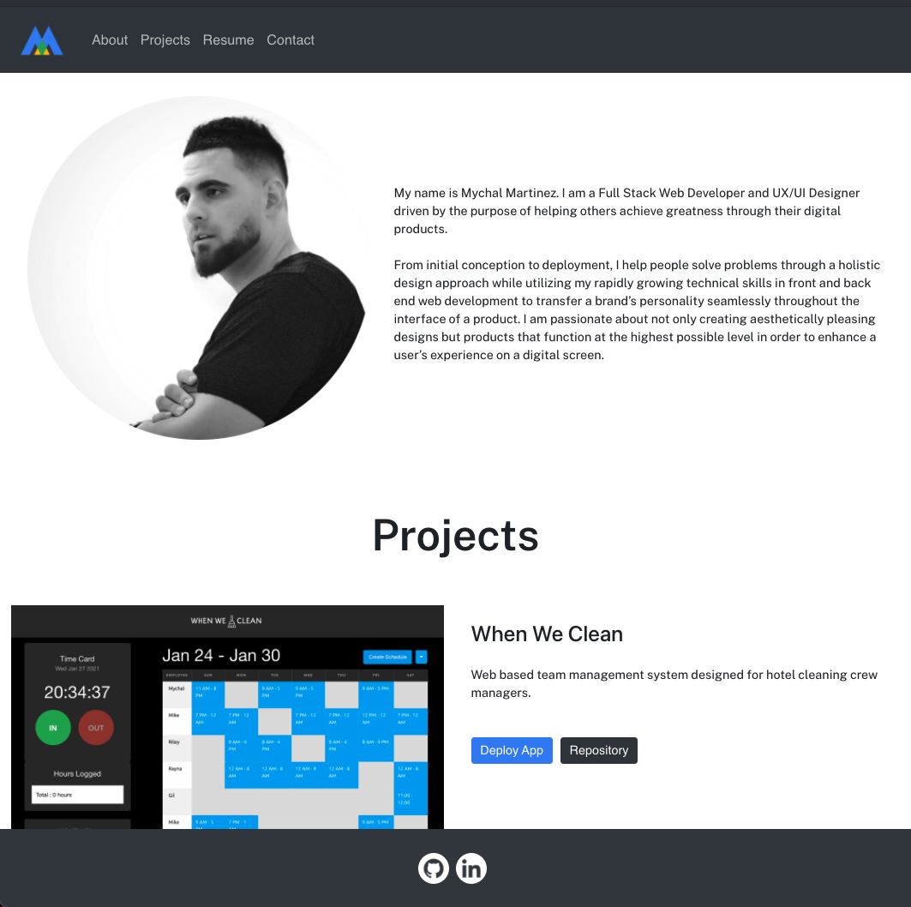

# React Portfolio

## Summary

The goal of this project was to create an aesthetically pleasing portfolio website that demonstrates my skills as a growing Full Stack Web Developer and UX/UI Designer. This application showcases six projects that I have completed in Denver University's Coding Boot Camp as well as on my own time.

## Technologies Used

HTML 5 
CSS 3 
Bootstrap 4 
React

## Deployed Links

[Portfolio](https://milehighcoder.github.io/react-portfolio) 
[Repository](https://github.com/milehighcoder/react-portfolio)

## Screenshots

